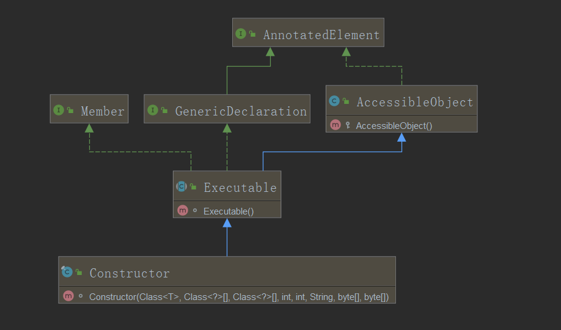

# <p align="center">Java反射-笔记</p>

一、认识java反射机制

[01 | 反射机制简介](#01)    
[02 | Class类对象的三种实例化模式](#02)

二、反射应用案例

[03 | 反射实例化对象](#03)    
[04 | 反射与工厂设计模式](#04)    
[05 | 反射与单例设计模式](#05)   

三、反射与类操作

[06 | 反射获取类结构信息](#06)   
[07 | 反射调用构造方法](#07)    
[08 | 反射调用普通方法](#08)    
[09 | 反射调用成员](#09)    
[10 | Unsafe工具类](#10)

四、反射与简单java类

[11 | 传统简单java类](#11)   
[12 | 属性自动设置解决方案](#12)    
[13 | 单级属性配置](#13)    
[14 | 设置多种数据类型](#14)    
[15 | 级联对象实例化](#15)   
[16 | 级联属性设置](#16)   

---

---

---
<h2 id="01">01 | 反射机制简介</h2>

---

在java语言中,之所以会有如此众多的开源技术支撑,很大的一部分来源于java最大特征--反射机制.能够灵活的去使用反射机制进行项目的开发与设计,才能够真正接触到java的精髓.所有的技术实现的目标只有一点:重用性.

对于反射技术,首先应该考虑"反"与"正"的概念,所谓的"正"操作指的是当你要使用一个类的时候,要先导入程序所在的包,而后根据类进行对象的实例化,并且依靠对象调用类中的方法.但是"反"则为,根据实例化对象,反推出其类型.

--范例:正向操作

```
package cn.xiechong.demo1;

import java.util.Date;//1.当如程序所在的包,知道对象的出处

public class JavaAPIDemo {
    public static void main(String[] args) {
        Date date = new Date();     //2.通过类产生实例化对象
        System.out.println(date.getTime());     //3.根据对象调用类中的方法
    }
}
```

如果想要实现"反"的操作,那么首先要采用的就是Object类中所提供的操作方法:```public final native Class<?> getClass()```

--范例:观察getClass()的应用

```
1 public class GetClassDemo {
2     public static void main(String[] args) {
3         Date date = new Date();
4         System.out.println(date.getTime());
5         //根据实例化对象找到其所属的类型
6         System.out.println("date: " + date.getClass());
7     }
8 }
```

getClass()可以帮助使用者找到对象的根源

--运行结果
```
1610165026078
date: class java.util.Date

Process finished with exit code 0
```

---
<h2 id="02">02 | Class类对象的三种实例化模式</h2>

---

反射之中的所有的核心操作都是通过Class类对象展开的,Class类是反射操作的根源所在,但是这个类如果要想获取他的实例化对象,可以采用三种方式完成,首先观察Class类的定义:
```
public final class Class<T> implements java.io.Serializable,
                              GenericDeclaration,
                              Type,
                              AnnotatedElement
```

从JDK1.5开始Class类在定义的时候可以使用泛型进行标记,这样的用法主要啊是希望可以避免所谓的向下转型.

1. Object类支持,Object类可以根据实例化对象获取Class对象:public final native Class<?> getClass()

```
package cn.xiechong.demo1;

public class JavaAPIDemo {
    public static void main(String[] args) {
        Person person = new Person();   // 已经存在有指定类的实例化对象
        Class<? extends Person> cls = person.getClass();
        System.out.println(cls);
        System.out.println(cls.getName());  //获取类的完成名称
    }
}
```

这种方式存在一个不是缺点的缺点:如果现在只是想获得Class类对象,则必须产生指定类对象后才可以获得.

2. JVM直接支持:采用类.class的形式实例化:此种形式需要导入类所在的开发包

```
package cn.xiechong.demo1;

import cn.xiechong.vo.Person;

public class JavaAPIDemo {
    public static void main(String[] args) {
        Class<? extends Person> cls = Person.class;
        System.out.println(cls);
        System.out.println(cls.getName());  //获取类的完成名称
    }
}
```

3. Class类支持,在Class类中提供有一个操作的static方法:

```public static Class<?> forName(String className)throws ClassNotFoundException:```


```
package cn.xiechong.demo1;

public class JavaAPIDemo {
    public static void main(String[] args) throws ClassNotFoundException {
        // 此时Person类位于cn.xiechong.vo包中; 该方式不需要导包
        Class<?> aClass = Class.forName("cn.xiechong.vo.Person");
        System.out.println(aClass);
    }
}

```

这种模式最大的特点是可以直接采用字符串的形式定义要使用的类型,并且程序中不需要编写任何的import语句,如果此时无法找到要使用的程序类,则会出现如下异常
```
package cn.xiechong.demo1;

public class JavaAPIDemo {
    public static void main(String[] args) throws ClassNotFoundException {
        // 此时Person类位于cn.xiechong.vo包中; 该方式不需要导包
        Class<?> aClass = Class.forName("反射.认识反射机制.Person");
        System.out.println(aClass);
    }
}

Exception in thread "main" java.lang.ClassNotFoundException: 反射.认识反射机制.Person
	at java.base/jdk.internal.loader.BuiltinClassLoader.loadClass(BuiltinClassLoader.java:581)
	at java.base/jdk.internal.loader.ClassLoaders$AppClassLoader.loadClass(ClassLoaders.java:178)
	at java.base/java.lang.ClassLoader.loadClass(ClassLoader.java:521)
	at java.base/java.lang.Class.forName0(Native Method)
	at java.base/java.lang.Class.forName(Class.java:315)
	at cn.xiechong.demo1.JavaAPIDemo.main(JavaAPIDemo.java:6)

```


---
<h2 id="03">03 | 反射实例化对象</h2>

---

经过一系列的分析之后发现虽然可以获取Class类的实例化对象,但是依然觉得这个对象的获取意义不是很大,因此可以通过以下几个案例去理解反射的核心意义

反射实例化对象:获取Class对象之后最大的意义并不是在于只是一个对象的实例化操作形式,更重要的是Class类中提供有一个对象的反射实例化方法
* 在JDK1.9之前的实例化（@Deprecated）:```public T newInstance() throw InstantiationException,IllegalAccessException```,该方法代替了new 关键字的使用
* 在JDK1.9之后则发生了变化:```class.getDeclaredConstructor().newInstance();```

范例:通过newInstance()方法实例化对象

```
package cn.xiechong.vo;

public class Person {
    public Person() {
        // 任何情况下只要实例化对象则一定要调用类中的构造方法
        System.out.println("Person对象实例化了");
    }

    @Override
    public String toString() {
        return "我是一个好人";
    }

}
```

```
package cn.xiechong.demo2;

public class JavaAPIDemo2 {
    public static void main(String[] args) throws ClassNotFoundException, IllegalAccessException,
            InstantiationException {
        Class<?> aClass = Class.forName("cn.xiechong.vo.Person");
        Object o = aClass.newInstance();    //实例化对象
        System.out.println(o);
    }
}
```

运行结果
```
Person对象实例化了
我是一个好人

Process finished with exit code 0
```

```
package cn.xiechong.demo2;

public class JavaAPIDemo2 {
    public static void main(String[] args) throws Exception {
        Class<?> aClass = Class.forName("cn.xiechong.vo.Person");
        Object o = aClass.getDeclaredConstructor().newInstance(); // JDK 1.9 after 实例化对象
        System.out.println(o);
    }
}
```

现在通过反射实现的对象实例化处理,依然要调用类中的无参构造方法,其本质等价于“类 对象 = new 类()”，即new 关键字的使用，相当于隐含了关键字new，而直接使用字符串进行了替代。但是该方法在JDK1.9之后被替代了,因为默认的Class类中的newInstance()方法只能够调用无参构造,所以很多的开发者认为其描述的不准确,于是将其变换了形式(后续构造方法会说明)


---
<h2 id="04">04 | 反射与工厂设计模式</h2>

---

如果要想进行对象的实例化处理除了可以使用关键字new 之外，还可以通过反射机制来完成。那么思考一个问题：为什么要提供有一个反射的实例化？到底是使用关键字new还是使用反射进行对象实例化呢？

如果想要更好的解决此类问题，最好的解释方案就是通过工厂设计模式来解决。工厂设计模式的最大特点：客户端的程序类不直接牵扯到对象的实例化管理，只与接口发生关联，通过工厂获取接口的实例化对象，传统的工厂设计模式：

```
package cn.xiechong.demo2;

public class FactoryDemo {
    public static void main(String[] args) {
        IMessage message = new NetMessage();// 如果直接实例化则一定会有耦合问题
    }
}

interface IMessage {
    public void send();// 消息发送
}

/**
 * 网络消息实现类
 */
class NetMessage implements IMessage {
    @Override
    public void send() {
        System.out.println("发送网络消息");
    }
}
```

在实际的开发中，接口的主要作用是为不同的层提供有一个操作的标准。但是此时如果直接将一个子类设置为接口实例化操作，那么一定会有耦合问题，所以使用了工厂设计模式来解决此问题。

范例：利用工厂设计模式解决

```
package cn.xiechong.demo2;

public class FactoryDemo {
    public static void main(String[] args) {
        IMessage message = Factory.getInstance("NetMessage");
        message.send();
    }
}

class Factory {
    // 没有产生实例化对象的意义
    private Factory() {
    }

    public static IMessage getInstance(String className) {
        if ("NetMessage".equals(className)) {
            return new NetMessage();
        }
        return null;
    }
}

interface IMessage {
    public void send();// 消息发送
}

/**
 * 网络消息实现类
 */
class NetMessage implements IMessage {
    @Override
    public void send() {
        System.out.println("发送网络消息");
    }
}
```

此种工厂设计模式属于静态工厂设计模式，此时如果追加一个子类，那么工厂类就需要进行相应的修改(追加相应的判断语句)，否则无法获得新的子类的实例化对象。

工厂设模式最有效解决的是子类与客户端的耦合问题，但是解决的核心思想是在于提供有一个工厂类作为过渡端，可是随着项目的进行，IMessage接口可能会有更多的子类，而且随着时间的推移，子类会越来越多，因此工厂类永远都需要修改，并且永无停止之日。

此时最好的解决方案就是不使用关键字new来完成对象的实例化，因为关键字new在使用的时候需要有一个明确的类存在。而 newInstance() 的方法只需要有一个明确表示类名称的字符串即可应用：

```
package cn.xiechong.demo2;

public class FactoryDemo {
    public static void main(String[] args) throws Exception {
        IMessage message = Factory.getInstance("cn.xiechong.demo2.NetMessage");
        message.send();
    }
}

class Factory {
    // 没有产生实例化对象的意义
    private Factory() {
    }

    public static IMessage getInstance(String className) throws Exception {
        return (IMessage) Class.forName(className).getDeclaredConstructor().newInstance();
    }
}

interface IMessage {
    public void send();// 消息发送
}

/**
 * 网络消息实现类
 */
class NetMessage implements IMessage {
    @Override
    public void send() {
        System.out.println("发送网络消息");
    }
}
```

此时如果对子类继续进行扩充的话，是没有必要修改工厂类的。利用反射机制实现的工厂设计模式，最大的优势在于，对于接口的子类的扩充，将不再影响到工厂类的定义。但是现在依然需要进行思考，在实际的项目开发之中，有可能会存在大量的接口，并且这些接口可能都需要通过工厂类来实例化对象，所以此时的工厂设计模式不应该只为一个IMessage接口服务，而应该变为为所有的接口服务(使用泛型实现开发需求)：


```
 package cn.xiechong.demo2;

public class FactoryDemo {
    public static void main(String[] args) throws Exception {
        IMessage message = Factory.getInstance("cn.xiechong.demo2.NetMessage", IMessage.class);
        message.send();
        IService instance = Factory.getInstance("cn.xiechong.demo2.HouseService", IService.class);
        instance.service();
    }
}

class Factory {
    // 没有产生实例化对象的意义，所以构造方法私有化
    private Factory() {
    }

    /**
     * 获取接口实例化对象
     *
     * @param className 接口的子类
     * @param tClass    描述的是一个接口的类型
     * @return 如果子类存在则返回指定接口实例化对象
     * @throws Exception
     */
    public static <T> T getInstance(String className, Class<T> tClass) throws Exception {
        return tClass.cast(Class.forName(className).getDeclaredConstructor().newInstance());
    }
}


interface IMessage {
    void send();// 消息发送
}

/**
 * 网络消息实现类
 */
class NetMessage implements IMessage {
    @Override
    public void send() {
        System.out.println("发送网络消息");
    }
}

/**
 * 服务实现类
 */
interface IService {
    void service();
}

class HouseService implements IService {
    @Override
    public void service() {
        System.out.println("为您的住房提供服务.");
    }
}
```

此时的工厂设计模式才是所谓的高可用的工厂设计模式，而这种操作的实现依赖的就是泛型。此时的工厂设计模式将不再受限于指定的接口，可以为所有的接口提供实例化对象。


---
<h2 id="05">05 | 反射与单例设计模式</h2>

---

单例设计模式的核心本质在于类内部的构造方法私有化，在类的内部产生实例化对象之后在外部通过static方法获取到实例化对象进行类中的结构调用。单例设计模式一共有两种，懒汉式和饿汉式（饿汉式的单例是不再本次的讨论范围之内的，主要讨论懒汉式的单例）

范例：观察懒汉式单例的问题

```
 1 class Singleton {
 package cn.xiechong.demo2;

public class Singleton {
    private static Singleton instance = null;

    private Singleton() {
    }

    public static Singleton getInstance() {
        if (instance == null) {
            instance = new Singleton();
        }
        return instance;
    }

    public void print() {
        System.out.println("单例模式加载");
    }

}

class LazyLoadDemo {
    public static void main(String[] args) {
        Singleton singleton = Singleton.getInstance();
        singleton.print();
    }
}
```

此时我们的操作是在单线程的环境下运行的，如果使用多线程

```
package cn.xiechong.demo2;

public class Singleton {
    private static Singleton instance = null;

    private Singleton() {
        System.out.println(Thread.currentThread().getName() + " 实例化单例对象");
    }

    public static Singleton getInstance() {
        if (instance == null) {
            instance = new Singleton();
        }
        return instance;
    }

    public void print() {
        System.out.println("单例模式加载");
    }

}

class LazyLoadDemo {
    public static void main(String[] args) {
        for (int i = 0; i < 3; i++) {
            new Thread(() -> {
                Singleton.getInstance();
            }, "[单例创建者" + (i + 1) + "]").start();
        }
    }
}
```

运行结果
```
[单例创建者3] 实例化单例对象
[单例创建者2] 实例化单例对象
[单例创建者1] 实例化单例对象

Process finished with exit code 0
```

单例设计模式最大的特点是在整体运行之中，只允许产生一个实例化对象，当有了若干实例化对象之后，那么就不是单例设计模式了，我们可以大致分析单例模式的运行流程如下：
* 1.判断instance是否为空？   
* 2.如果instance为空,实例化instance对象   
* 3.返回当前的instance

因此在多线程的设计中，每一个线程在执行步骤1的时候都会认为此时的对象为空，那么都会去创建这个对象的实例，这样一来单例设计模式也就失去了意义，如果想要解决这类问题，关键的核心就在于要解决同步处理，而解决同步处理的核心就是使用synchronized关键字

```
package cn.xiechong.demo2;

public class Singleton {
    private static Singleton instance = null;

    private Singleton() {
        System.out.println(Thread.currentThread().getName() + " 实例化单例对象");
    }

    public static synchronized Singleton getInstance() {
        if (instance == null) {
            instance = new Singleton();
        }
        return instance;
    }

    public void print() {
        System.out.println("单例模式加载");
    }

}

class LazyLoadDemo {
    public static void main(String[] args) {
        for (int i = 0; i < 3; i++) {
            new Thread(() -> {
                Singleton.getInstance();
            }, "[单例创建者" + (i + 1) + "]").start();
        }
    }
}

```

运行结果
```
[单例创建者1] 实例化单例对象

Process finished with exit code 0
```

此时却是进行了同步处理，但是这个同步的代价却是很大的，因为效率会降低。因为整体代码中实际上只有一块区域需要同步处理，那就是instance对象的实例化处理部分，在这样的情况下同步加的未免显得有些草率，更加合理的进行同步处理：

```
package cn.xiechong.demo2;

public class Singleton {
    // 在对象实例化的时候，应该立刻与主内存中的实例对象保持同步，而不应该存在副本，添加volatile
    private static volatile Singleton instance = null;

    private Singleton() {
        System.out.println(Thread.currentThread().getName() + " 实例化单例对象");
    }

    public static Singleton getInstance() {
        if (instance == null) {
            synchronized (Singleton.class) {// static方法只能使用Singleton.class
                if (instance == null) {
                    instance = new Singleton();
                }
            }
        }
        return instance;
    }

    public void print() {
        System.out.println("单例模式加载");
    }

}

class LazyLoadDemo {
    public static void main(String[] args) {
        for (int i = 0; i < 3; i++) {
            new Thread(() -> {
                Singleton.getInstance();
            }, "[单例创建者" + (i + 1) + "]").start();
        }
    }
}
```

**面试题**：请编写单例设计模式

* 【100%】直接编写一个饿汉式的单例设计模式
* 【120%】在Java中哪里使用到单例设计模式？Runtime类、Spring框架
* 【200%】懒汉式单例设计模式的问题？   


---
<h2 id="06">06 | 反射与操作类</h2>

---

在反射机制的处理过程之中不仅仅只是一个实例化对象的处理操作，更多的情况下还有类的组成的操作，任何一个类的基本组成结构：父类(父接口)，包，属性，方法（构造方法，普通方法）

获取类的基本信息   
* 一个类的基本信息主要包括的是所在的包名称，父类的定义，父接口的定义。

范例：定义一个程序类

```
package cn.xiechong.service;

public interface IChannelService {
    boolean connect();
}
```

```
package cn.xiechong.service;

/**
 * 消息服务
 */
public interface IMessageService {
    void send();
}
```

```
package cn.xiechong.demo3;

public abstract class AbstractBase {
}
```


```
package cn.xiechong.demo3;

import cn.xiechong.service.IChannelService;
import cn.xiechong.service.IMessageService;

/**
 * 类结构信息
 */
public class ClassHierarchyInfo extends AbstractBase implements IMessageService, IChannelService {
    @Override
    public boolean connect() {
        return true;
    }

    @Override
    public void send() {
        if (this.connect()) {
            System.out.println("消息发送");
        }
    }
}
```

如果此时要想获取一些类的基础信息则可以通过class类中的如下方法：   
* 获取包名称： ```public Package getPackage()```   
* 获取继承父类： ```public Class<? super T> getSuperclass();```   
* 获取实现父接口： ```public Class<?>[] getInterfaces()```


```
package cn.xiechong.demo3;

public class GettingClassHierarchyDemo {
    public static void main(String[] args) {
        Class<ClassHierarchyInfo> gettingClassHierarchyClass = ClassHierarchyInfo.class;// 获取指定类的class对象
        Package aPackage = gettingClassHierarchyClass.getPackage();// 获取指定类的包定义
        System.out.println("获取包名称: " + aPackage.getName());
        Class<? super ClassHierarchyInfo> superclass = gettingClassHierarchyClass.getSuperclass();// 获取父类
        System.out.println("ClassHierarchyInfo获取父类: " + superclass.getName());
        System.out.println("superclass获取父类: " + superclass.getSuperclass().getName());
        Class<?>[] interfaces = gettingClassHierarchyClass.getInterfaces();// 获取父接口
        for (int i = 0; i < interfaces.length; i++) {
            System.out.println("获取父接口" + (i + 1) + ": " + interfaces[i].getName());
        }
    }

}
```

运行结果

```
获取包名称: cn.xiechong.demo3
ClassHierarchyInfo获取父类: cn.xiechong.demo3.AbstractBase
superclass获取父类: java.lang.Object
获取父接口1: cn.xiechong.service.IMessageService
获取父接口2: cn.xiechong.service.IChannelService

Process finished with exit code 0
```

获取一个类的Class对象之后就以为这个对象可以获取类之中的一切继承结构信息，因此我们可以知道Class可以描述普通类，抽象类，接口。


---
<h2 id="07">07 | 反射调用构造方法</h2>

---

在一个类之中除了有继承的关系之外，最为重要的操作就是类中的结构处理了，类中的中首先需要关注的就是构造方法的使用问题，实际上在之前通过反射实例化对象的使用就已经接触到了构造方法的问题了，及newInstance()方法，所有类的构造方法的获取都可以直接通过Class类来完成，该类中定义有如下的几个方法：

* 获取指定构造方法(根据参数类型): ```Constructor<T> getDeclaredConstructor(Class<?>... parameterTypes)```
* 获取指定构造方法: ```Constructor<T> getConstructor(Class<?>... parameterTypes)```
* 获取所有构造方法: ```Constructor<?>[] getDeclaredConstructors()```   
* 获取所有构造方法: ```Constructor<?>[] getConstructors()```   

```
package cn.xiechong.demo3;

public abstract class AbstractBase {
    public AbstractBase() {
    }

    public AbstractBase(String name) {
    }

}
```

```
package cn.xiechong.demo3;

import cn.xiechong.service.IChannelService;
import cn.xiechong.service.IMessageService;

/**
 * 类结构信息
 */
public class ClassHierarchyInfo extends AbstractBase implements IMessageService, IChannelService {

    public ClassHierarchyInfo() {
    }

    public ClassHierarchyInfo(String name, String msg) {

    }

    @Override
    public boolean connect() {
        return true;
    }

    @Override
    public void send() {
        if (this.connect()) {
            System.out.println("消息发送");
        }
    }
}

```


范例：获取全部构造方法

```
package cn.xiechong.demo3;

import java.lang.reflect.Constructor;

public class ConstructorDemo {
    public static void main(String[] args) {
        Class<ClassHierarchyInfo> classHierarchyInfoClass = ClassHierarchyInfo.class;// 获取指定类的class对象
        Constructor<?>[] constructors = classHierarchyInfoClass.getDeclaredConstructors();// 获取全部构造
        for (Constructor<?> constructor : constructors) {
            System.out.println(constructor);
        }
        System.out.println("========================");

        constructors = classHierarchyInfoClass.getConstructors();
        for (Constructor<?> constructor : constructors) {
            System.out.println(constructor);
        }
    }
}
```

运行结果
```
public cn.xiechong.demo3.ClassHierarchyInfo()
public cn.xiechong.demo3.ClassHierarchyInfo(java.lang.String,java.lang.String)
========================
public cn.xiechong.demo3.ClassHierarchyInfo()
public cn.xiechong.demo3.ClassHierarchyInfo(java.lang.String,java.lang.String)
```

此时获取的是类之中的全部构造方法，但是也可以获取一个指定参数的构造。

```
package cn.xiechong.demo3;

import cn.xiechong.service.IChannelService;
import cn.xiechong.service.IMessageService;

/**
 * 类结构信息
 */
public class ClassHierarchyInfo extends AbstractBase implements IMessageService, IChannelService {

    private String name;
    private String msg;

    public ClassHierarchyInfo() {
    }

    public ClassHierarchyInfo(String name, String msg) {
        this.name = name;
        this.msg = msg;
    }

    @Override
    public String toString() {
        return "ClassHierarchyInfo{" +
                "name='" + name + '\'' +
                ", msg='" + msg + '\'' +
                '}';
    }

    @Override
    public boolean connect() {
        return true;
    }

    @Override
    public void send() {
        if (this.connect()) {
            System.out.println("消息发送");
        }
    }
}
```

需要调用类的有参构造方法，那么我们应该传入参数，观察 java.lang.reflect.Constructor 类的方法

实例化方法:
```
public T newInstance(Object... initargs)throws InstantiationException,IllegalAccessException,IllegalArgumentException,InvocationTargetException
```

范例：调用指定构造实例化对象

```
package cn.xiechong.demo3;

import java.lang.reflect.Constructor;

/**
 * 调用有参构造方法
 */
public class OneConstructorDemo {
    public static void main(String[] args) throws Exception {
        Class<ClassHierarchyInfo> classHierarchyInfoClass = ClassHierarchyInfo.class;// 获取指定类的class对象
        Constructor<ClassHierarchyInfo> constructor = classHierarchyInfoClass.getConstructor(String.class, String.class);
        ClassHierarchyInfo classHierarchyInfo = constructor.newInstance("张三", "优秀");
        System.out.println(classHierarchyInfo);
    }

}
```

运行结果

```
ClassHierarchyInfo{name='张三', msg='优秀'}

Process finished with exit code 0
```
虽然程序代码本身允许开发者调用有参构造处理，但是如果从实际开发来讲，所有的类中最好提供有无参构造(特别是使用反射的类中)，这样的实例化能够达到很高的统一性。

我们观察Constructor类的结构发现在JDK1.8之后提供了一个**Executable类**作为 Constructor 类的父类对象。

   


---
<h2 id="08">08 | 反射调用普通方法</h2>

---

在进行反射处理的时候，也可以通过反射获取类中的全部方法，但是需要提醒的是，如果要想通过反射调用这些方法，必须有一个前提条件，类之中要提供有实例化对象

在Class类中提供有如下的操作可以获取方法对象：

* 获取全部方法：```public Method[] getMethods()throws SecurityException```
* 获取指定方法：```Method getMethod(String name, Class<?>... parameterTypes)```
* 获取本类全部方法：```Method[] getDeclaredMethods()```
* 获取本类指定方法：```Method getDeclaredMethod(String name, Class<?>... parameterTypes)```

范例：获取全部方法
```
package cn.xiechong.demo3;

import cn.xiechong.vo.Person;
import java.lang.reflect.Method;

/**
 * 反射调用普通方法
 */
public class MethodDemo {
    public static void main(String[] args) {
        Class<Person> personClass = Person.class;       //获取指定类的class对象
        // 获取全部方法
        Method[] methods = personClass.getMethods();
        for (Method method : methods) {
            System.out.println(method);
        }
    }
}
```

运行结果
```
public java.lang.String cn.xiechong.vo.Person.getName()
public java.lang.String cn.xiechong.vo.Person.toString()
public boolean cn.xiechong.vo.Person.connect()
public void cn.xiechong.vo.Person.setName(java.lang.String)
public void cn.xiechong.vo.Person.send()
public final native void java.lang.Object.wait(long) throws java.lang.InterruptedException
public final void java.lang.Object.wait(long,int) throws java.lang.InterruptedException
public final void java.lang.Object.wait() throws java.lang.InterruptedException
public boolean java.lang.Object.equals(java.lang.Object)
public native int java.lang.Object.hashCode()
public final native java.lang.Class java.lang.Object.getClass()
public final native void java.lang.Object.notify()
public final native void java.lang.Object.notifyAll()

Process finished with exit code 0

```

可以发现将父类Object中的方法也获取到了，如果只是想获取本地的方法
```
package cn.xiechong.demo3;

import cn.xiechong.vo.Person;

import java.lang.reflect.Method;

/**
 * 反射调用普通方法
 */
public class MethodDemo {
    public static void main(String[] args) {
        Class<Person> personClass = Person.class;// 获取指定类的class对象
        {// 获取全部方法
            Method[] methods = personClass.getMethods();
            for (Method method : methods) {
                System.out.println(method);
            }
        }

        System.out.println("=========================");

        {
            // 获取全部方法
            Method[] methods = personClass.getDeclaredMethods();
            for (Method method : methods) {
                System.out.println(method);
            }
        }
    }
}

```

运行结果
```
public java.lang.String cn.xiechong.vo.Person.getName()
public java.lang.String cn.xiechong.vo.Person.toString()
public boolean cn.xiechong.vo.Person.connect()
public void cn.xiechong.vo.Person.setName(java.lang.String)
public void cn.xiechong.vo.Person.send()
public final native void java.lang.Object.wait(long) throws java.lang.InterruptedException
public final void java.lang.Object.wait(long,int) throws java.lang.InterruptedException
public final void java.lang.Object.wait() throws java.lang.InterruptedException
public boolean java.lang.Object.equals(java.lang.Object)
public native int java.lang.Object.hashCode()
public final native java.lang.Class java.lang.Object.getClass()
public final native void java.lang.Object.notify()
public final native void java.lang.Object.notifyAll()
=========================
public java.lang.String cn.xiechong.vo.Person.getName()
public java.lang.String cn.xiechong.vo.Person.toString()
public boolean cn.xiechong.vo.Person.connect()
public void cn.xiechong.vo.Person.setName(java.lang.String)
public void cn.xiechong.vo.Person.send()

Process finished with exit code 0

```

但是需要注意的是这个时候的方法信息的获取是依靠Method类提供的toString()方法来完成的，很多时候也可以由用户自己拼凑方法的输出

```
package cn.xiechong.demo3;

import cn.xiechong.vo.Person;
import java.lang.reflect.Method;
import java.lang.reflect.Modifier;

/**
 * 这种代码你只需要清楚可以根据反射获取方法的结构即可，不需要做过多的深入理解。
 */
public class MyMethodDemo {
    public static void main(String[] args) {
        Class<Person> personClass = Person.class;// 获取指定类的class对象
        Method[] methods = personClass.getMethods();
        for (Method method : methods) {
            String modifier = Modifier.toString(method.getModifiers());// 获取访问修饰符
            String returnType = method.getReturnType().getName();// 获取方法的返回类型
            Class<?>[] parameterTypes = method.getParameterTypes();// 获取参数类型
            StringBuffer buffer = new StringBuffer();
            buffer.append("(");
            for (int i = 0; i < parameterTypes.length; i++) {
                buffer.append(parameterTypes[i].getName());
                buffer.append(" arg").append(i);
                if (i < parameterTypes.length - 1) {
                    buffer.append(",");
                }
            }
            buffer.append(")");
            String parameterType = buffer.toString();
            Class<?>[] exceptionTypes = method.getExceptionTypes();// 获取异常类型
            buffer = new StringBuffer();
            if (exceptionTypes.length > 0) {
                buffer.append(" throws ");
                for (int i = 0; i < exceptionTypes.length; i++) {
                    buffer.append(exceptionTypes[i].getName());
                    buffer.append(" e").append(i);
                    if (i < exceptionTypes.length - 1) {
                        buffer.append(",");
                    }
                }
            }
            String exceptionType = buffer.toString();
            System.out.println(modifier + " " + returnType + " " + method.getName() + parameterType + "" + exceptionType);
        }
    }
}
```

运行结果
```
public void send()
public java.lang.String getName()
public java.lang.String toString()
public boolean connect()
public void setName(java.lang.String arg0)
public final native void wait(long arg0) throws java.lang.InterruptedException e0
public final void wait(long arg0,int arg1) throws java.lang.InterruptedException e0
public final void wait() throws java.lang.InterruptedException e0
public boolean equals(java.lang.Object arg0)
public native int hashCode()
public final native java.lang.Class getClass()
public final native void notify()
public final native void notifyAll()

Process finished with exit code 0
```

在Method类中有一个重要的方法，用于反射调用方法（如下）。
```
public Object invoke(Object obj, Object... args)
    throws IllegalAccessException, IllegalArgumentException,
    InvocationTargetException
```

在Person类中有name属性追加有setter与getter方法：

```
package cn.xiechong.vo;

import cn.xiechong.demo3.AbstractBase;
import cn.xiechong.service.IChannelService;
import cn.xiechong.service.IMessageService;

public class Person extends AbstractBase implements IMessageService, IChannelService {
    private String name;
    private int age;

    public Person() {
    }

    public Person(String name, int age) {
        this.name = name;
        this.age = age;
    }

    @Override
    public boolean connect() {
        return true;
    }

    @Override
    public void send() {
        if (this.connect()) {
            System.out.println("消息发送");
        }
    }

    public String getName() {
        return name;
    }

    public void setName(String name) {
        this.name = name;
    }

    @Override
    public String toString() {
        return "Person{" +
                "name='" + name + '\'' +
                ", age=" + age +
                '}';
    }
}
```

通过反射机制来实现person类之中的setter与getter方法的调用处理，并且不进行person类的包导入操作

```
package cn.xiechong.demo3;

import java.lang.reflect.Method;

public class GetterAndSetterDemo {
    public static void main(String[] args) throws Exception {
        // 在不导入开发包的情况下实现属性的配置
        Class<?> aClass = Class.forName("cn.xiechong.vo.Person");// 获取指定类的class对象
        String attribute = "name";// 要操作的类属性
        String value = "张三";// 要设置的属性内容
        // 1.任何情况写想要调用类中的属性或者调用类中的方法都必须保证存在有实例化对象,既然不导包，就要使用反射来做对象实例化
        Object obj = aClass.getDeclaredConstructor().newInstance();// 调用无参构造实例化
        // 2.如果想要进行方法的调用,一定要获取方法的名称
        String setMethodName = "setName";
        Method method = aClass.getDeclaredMethod(setMethodName, String.class);
        method.invoke(obj, value);// 等价于 person.setName("小强");
        System.out.println("toString: " + obj);
        String getMethodName = "getName";
        Method getName = aClass.getDeclaredMethod(getMethodName);
        System.out.println("getName: " + getName.invoke(obj));// 等价于 person.getName();
    }
}
```

运行结果
```
toString: Person{name='张三', age=0}
getName: 张三

Process finished with exit code 0
```

利用此类操作整体的形式不会有任何的明确的类对象产生，这样的处理避免了某一个类的耦合问题。


---
<h2 id="09">09 | 反射调用成员</h2>

---

类结构之中的最后一个核心的组成就是成员(Field)，大部分情况下都会将其称为成员属性，对成员属性的获取也是通过Class类来完成的，在这个类中提供有如下两组操作方法：

* 获取本类全部成员: ```Field[] getDeclaredFields()```
* 获取本类指定成员: ```Field getDeclaredField(String name)```
* 获取父类全部成员: ```Field[] getFields()```
* 获取父类指定成员: ```Field getField(String name)```

修改AbstractBase类
```
package cn.xiechong.demo3;

public abstract class AbstractBase {
    public static final String BASE = "123456789";
    private String info = "hello world";
    protected static final String ABC = "888";

    public AbstractBase() {
    }

    public AbstractBase(String name) {
    }

}
```

```
package cn.xiechong.vo;

import cn.xiechong.demo3.AbstractBase;
import cn.xiechong.service.IChannelService;
import cn.xiechong.service.IMessageService;

public class Person extends AbstractBase implements IMessageService, IChannelService {
    public static final String NAME = "小张三";
    private String name;
    private int age;

    public Person() {
    }

    public Person(String name, int age) {
        this.name = name;
        this.age = age;
    }

    @Override
    public boolean connect() {
        return true;
    }

    @Override
    public void send() {
        if (this.connect()) {
            System.out.println("消息发送");
        }
    }

    public String getName() {
        return name;
    }

    public void setName(String name) {
        this.name = name;
    }

    @Override
    public String toString() {
        return "Person{" +
                "name='" + name + '\'' +
                ", age=" + age +
                '}';
    }
}
```

获取类中的成员

```
package cn.xiechong.demo3;

import java.lang.reflect.Field;

public class GetFieldDemo {
    public static void main(String[] args) throws Exception {
        Class<?> aClass = Class.forName("cn.xiechong.vo.Person");// 获取指定类的class对象
        Field[] fields = aClass.getFields();
        for (Field field : fields) {
            System.out.println(field);
        }
        System.out.println("======================");
        fields = aClass.getDeclaredFields();
        for (Field field : fields) {
            System.out.println(field);
        }
    }
}
```

运行结果
```
public static final java.lang.String cn.xiechong.vo.Person.NAME
public static final java.lang.String cn.xiechong.demo3.AbstractBase.BASE
======================
public static final java.lang.String cn.xiechong.vo.Person.NAME
private java.lang.String cn.xiechong.vo.Person.name
private int cn.xiechong.vo.Person.age

Process finished with exit code 0
```

从上述结果我们可以得知getFields()可以获得父类及子类的公有成员，而getDeclaredFields()可以获得子类的所有成员，但是在Field类中最为重要的操作形式并不是获取全部的成员，而是如下的三个方法：

* 设置属性内容: ```public void set(Object obj,Object value)throws IllegalArgumentException,IllegalAccessException```
* 获取属性内容: ```public Object get(Object obj)throws IllegalArgumentException,IllegalAccessException```
* 解除封装: ```public static void setAccessible(AccessibleObject[] array,boolean flag)throws SecurityException```


所有的成员都是在对象实例化之后进行空间分配的，所以此时一定要先有实例化对象之后，才可以进行成员的操作。

直接调用person类中的name私有成员：
```
package cn.xiechong.demo3;

import java.lang.reflect.Field;

public class UseNameDemo {
    public static void main(String[] args) throws Exception {
        Class<?> aClass = Class.forName("cn.xiechong.vo.Person");// 获取指定类的class对象
        Object obj = aClass.getConstructor().newInstance();
        Field name = aClass.getDeclaredField("name");
        name.setAccessible(true);// 解除封装
        name.set(obj, "张三");
        System.out.println(name.get(obj));
    }
}
```

运行结果
```
张三

Process finished with exit code 0
```

通过一系列的分析可以发现，类之中的构造方法，成员属性都可以通过反射实现调用，但是对于成员的反射调用很少这样直接处理，大部分操作都应该通过getter和setter处理，所以对于以上的代码只是能够说明反射具有这样的能力，而对于Field类在实际的开发之中只有一个方法最为常用：

* 获取成员类型: ```public Class<?> getType()```

获取Person类中的name成员的类型
```
package cn.xiechong.demo3;

import java.lang.reflect.Field;

public class UseNameDemo {
    public static void main(String[] args) throws Exception {
        Class<?> aClass = Class.forName("cn.xiechong.vo.Person");// 获取指定类的class对象
        Object obj = aClass.getConstructor().newInstance();
        Field name = aClass.getDeclaredField("name");
        System.out.println(name.getType().getName());// 获取完整类名称
        System.out.println(name.getType().getSimpleName());
    }
}
```

运行结果
```
java.lang.String
String

Process finished with exit code 0
```

在开发中进行反射处理的时候，往往会利用Field与Method类实现类中的setter方法的调用。


---
<h2 id="10">10 | Unsafe工具类</h2>

---

反射是java的第一大特点，一旦打开了反射的大门，就可以有更加丰富的类的设计形式，除了JVM本身支持的反射处理之外，在java里面也提供有一个Unsafe(不安全操作)，这个类的主要特点是可以利用反射来获取对象，并且直接使用底层的c++来代替JVM执行，即可以绕过JVM的相关的对象的管理机制，如果项目中使用了Unsafe类，那么项目之中将无法进行JVM的内存管理机制以及垃圾回收处理。

果要想使用Unsafe类首先就需要确认一下这个类之中定义的构造方法与常量问题

* 构造方法: private Unsafe(){}
* 私有常量:  private static final Unsafe theUnsafe;

但是需要注意的是在这个Unsafe的类中并没有提供static的方法，即不能通过类似与传统的单例设计模式中提供的样式进行操作，如果要想获得这个类的对象，就必须利用反射机制来完成：

```
package cn.xiechong.demo3;

import sun.misc.Unsafe;

import java.lang.reflect.Field;

public class GetUnsafeDemo {
    public static void main(String[] args) throws Exception {
        Field theUnsafe = Unsafe.class.getDeclaredField("theUnsafe");
        theUnsafe.setAccessible(true);// 解除封装处理
        Unsafe unsafe = (Unsafe) theUnsafe.get(null);// static属性不需要传递实例化对象
    }
}
```

在传统的开发之中，一个程序类必须要通过实例化对象后，才可以调用类中的普通方法，尤其以单例设计模式为例:
```
package cn.xiechong.demo3;

public class Singleton {
    private static final Singleton INSTANCE = new Singleton();

    private Singleton() {
    }

    public static Singleton getInstance() {
        return INSTANCE;
    }

    public void print() {
        System.out.println("实例化对象输出内容");
    }
}
```

利用Unsafe类绕过JVM的管理机制使用print()方法：
```
package cn.xiechong.demo3;

import sun.misc.Unsafe;

import java.lang.reflect.Field;

public class GetUnsafeDemo {
    public static void main(String[] args) throws Exception {
        Field theUnsafe = Unsafe.class.getDeclaredField("theUnsafe");
        theUnsafe.setAccessible(true);  //解除封装处理
        Unsafe unsafe = (Unsafe) theUnsafe.get(null);// static属性不需要传递实例化对象
        Singleton singleton = (Singleton) unsafe.allocateInstance(Singleton.class);
        singleton.print();
    }

```

```
package cn.xiechong.demo3;

public class Singleton {
    private static final Singleton INSTANCE = new Singleton();

    private Singleton() {
        System.out.println("构造方法");
    }

    public void print() {
        System.out.println("实例化对象输出内容");
    }
}
```

运行结果
```
构造方法
实例化对象输出内容

Process finished with exit code 0
```

Uusafe只能说为开发提供了一些更加方便的处理机制，但是这种操作由于不受JVM的管理，所以如果不是必须的情况下不建议使用。


---
<h2 id="11">11 | 传统简单java类</h2>

---

简单的java类主要是由属性所组成，并且提供有相应的setter以及getter的处理方法，同时简单java类最大的特征就是通过对象保存相应的类的属性内容，但是如果使用传统的简单java类的开发，那么也会面临非常麻烦的困难。

按照传统的做法，首先应该实例化Emp对象，而后通过实例化对象进行setter方法的调用来设置属性的内容。

```
package cn.xiechong.demo04.part00;

public class ReflectAndJavaClassDemo {
    public static void main(String[] args) {
        Emp emp = new Emp();
        emp.setEname("Mike");
        emp.setJob("code java");
        System.out.println("姓名: " + emp.getEname() + " 职位: " + emp.getJob());
    }

}

class Emp {
    private String ename;
    private String job;

    public void setEname(String ename) {
        this.ename = ename;
    }

    public void setJob(String job) {
        this.job = job;
    }

    public String getEname() {
        return ename;
    }

    public String getJob() {
        return job;
    }
}
```

在整个进行Emp对象实例化并设置数据的操作过程之中，设置数据的部分是为麻烦的，可以想象如果现在Emp类中提供有50个属性，
那么对于整个程序而言，将成为一大堆的setter方法的调用，即使使用构造方法赋值，也会造成很多的麻烦。或者咱们再进一步说明，
在一个开发之中，简单java类的个数是非常多的，那么如果所有的简单java类都牵扯到属性赋值的问题时，我们代码的重复率会非常的高。
按照传统直观的编程方式所带来的问题就是代码会存在大量的重复操作，如果要想解决对象的重复处理操作，那么唯一的解决方案就是反射机制，
反射机制最大的特征就是可以根据其自身的特点(Object类直接操作属性和方法，实现相同功能类的重复操作的抽象处理)。


---
<h2 id="12">12 | 属性自动设置解决方案</h2>

---

经过了分析之后已经确认了当前简单java类操作的问题所在，而对于开发者而言就需要想办法通过一种解决方案来实现属性内容的自动设置，那么这个时候的设置强烈建议采用字符串的形式来描述对应的类型：

1. 在进行程序开发的时候我们可以知道String字符串可以描述的类型由很多，并且也可以由开发者自行定义String字符串的结构，我们采用"内容|属性:内容|"的形式来为简单java类中的属性进行初始化；
2. 类设计的基本结构，应该由一个专门的工具类(ClassInstanceFactory类)负责所有的反射处理，即接收反射对象，同时可以获取指定类的实例化对象；
3. 设计的基本结构

```
package cn.xiechong.demo04.part00;

class Emp {
    private String ename;
    private String job;

    public void setEname(String ename) {
        this.ename = ename;
    }

    public void setJob(String job) {
        this.job = job;
    }

    public String getEname() {
        return ename;
    }

    public String getJob() {
        return job;
    }
}

class ClassInstanceFactory {
    private ClassInstanceFactory() {
    }// 构造方法私有化

    /**
     * 实例化对象创建的方法,该对象可以根据传入的字符串的结构"内容|属性:内容|"进行处理
     *
     * @param tClass 要进行反射实例化的Class类对象,有Class就可以反射实例化对象
     * @param value  要设置给对象的属性内容
     * @return 一个已经配置完内容的简单java类对象
     */
    public static <T> T create(Class<T> tClass, String value) {
        return null;
    }

}

public class ReflectAndJavaClassDemo {
    public static void main(String[] args) {
        // 在Emp类中,存在两个String类型的成员变量ename,job,以及其相关的getter,setter
        String value = "ename:Mike|job:code java";
        Emp emp = ClassInstanceFactory.create(Emp.class, value);// 产生实例化对象
    }
}
```

这样在当前的开发之中，所需要留给用户完善的就是ClassInstanceFactory.create()方法的具体实现。


---
<h2 id="13">13 | 单级属性配置</h2>

---

对于此时的Emp类型里面会发现所给出的数据类型都没有其他的引用关联了，只是描述了Emp本类的对象，这样的设置我们称他为单级属性配置，所以此时应该需要处理两件事情：

1. 需要通过反射进行指定类对象的实例化处理；
2. 进行内容的设置(Field属性类型，方法名称，要设置的内容)

```
package cn.xiechong.demo04.part01;

import java.lang.reflect.Field;
import java.lang.reflect.Method;

public class Emp {
    private String ename;
    private String job;

    public void setEname(String ename) {
        this.ename = ename;
    }

    public void setJob(String job) {
        this.job = job;
    }

    public String getEname() {
        return ename;
    }

    public String getJob() {
        return job;
    }
}

class ClassInstanceFactory {
    private ClassInstanceFactory() {
    }// 构造方法私有化

    /**
     * 实例化对象创建的方法,该对象可以根据传入的字符串的结构"内容|属性:内容|"进行处理
     *
     * @param tClass 要进行反射实例化的Class类对象,有Class就可以反射实例化对象
     * @param value  要设置给对象的属性内容
     * @return 一个已经配置完内容的简单java类对象
     */
    public static <T> T create(Class<T> tClass, String value) {
        // 如果想采用反射进行简单Java类对象的属性设置的时候,类中必须要有无参构造
        try {
            Object o = tClass.getDeclaredConstructor().newInstance();
            BeanUtils.setValue(o, value);// 通过反射设置属性
            return tClass.cast(o);// 获取对象
        } catch (Exception e) {
            e.printStackTrace();// 此时如果出现异常,将异常抛出也没有多大作用
            return null;
        }
    }

}

class BeanUtils {// 进行Bean处理的工具类

    private BeanUtils() {
    }

    /**
     * 实现指定对象的属性设置
     *
     * @param obj   要进行反射操作的实例化对象
     * @param value 包含有指定内容的字符串
     */
    public static void setValue(Object obj, String value) {
        String results[] = value.split("\\|");// 按照竖线进行每一组属性的拆分
        for (int i = 0; i < results.length; i++) {// 循环设置属性内容
            String[] attval = results[i].split(":");// 获取属性名称及内容
            try {
                Field field = obj.getClass().getDeclaredField(attval[0]);
                Method setMethod = obj.getClass().getDeclaredMethod("set" + StringUtils.initcap(attval[0]), field.getType());
                setMethod.invoke(obj, attval[1]);// 使用setter方法进行内容的赋值
            } catch (Exception e) {// 捕获异常,否则的话一个属性不存在将会导致所有的属性都无法正常赋值
            }
        }
    }
}

class StringUtils {
    private StringUtils() {
    }

    public static String initcap(String str) {
        if (str == null || str.equals("")) {
            return str;
        }
        if (str.length() == 1) {
            return str.toUpperCase();
        } else {
            return str.substring(0, 1).toUpperCase() + str.substring(1);
        }
    }

}
```

```
package cn.xiechong.demo04.part01;

/**
 * 单级属性配置
 */
public class ReflectAndJavaClassDemo {
    public static void main(String[] args) {
        // 在Emp类中,存在两个String类型的成员变量ename,job,以及其相关的getter,setter
        String value = "ename:Mike|job:code java";
        Emp emp = ClassInstanceFactory.create(Emp.class, value);// 产生实例化对象
        System.out.println("姓名: " + emp.getEname() + " 职位: " + emp.getJob());
    }
}
```
运行结果

```
姓名: Mike 职位: code java

Process finished with exit code 0
```

ClassInstanceFactory负责实例化对象并且调用BeanUtils类实现属性代码的设置，此时即便类中的属性再多，那么也可以轻松的实现setter的调用，轻松实现类对象实例化处理。


---
<h2 id="14">14 | 设置多种数据类型</h2>

---

虽然上述代码可以实现对于属性的配置，但是我们仍然需要考虑一个实际的情况，当前所给定的数据类型只能是String，但是在实际的开发之中，面对简单java类中的属性类型一般的可选为：Long(long)，Integer(int)，Double(double)，String，Date（日期，日期时间），所以这个时候对于当前的程序代码就必须做出修改，要求可以实现各种数据类型的配置。

既然要求可以实现不同类型的内容设置，并且BeanUtils类主要是完成属性赋值处理的，那么就可以在这个类之中追加有一些列的处理方法：

```
package cn.xiechong.demo04.part02;

import java.lang.reflect.Field;
import java.lang.reflect.Method;
import java.text.ParseException;
import java.text.SimpleDateFormat;
import java.util.Date;

public class Emp {
    private long empo;
    private String ename;
    private String job;
    private double salary;
    private Date hireDate;

    public void setEname(String ename) {
        this.ename = ename;
    }

    public void setJob(String job) {
        this.job = job;
    }

    public String getEname() {
        return ename;
    }

    public String getJob() {
        return job;
    }

    public long getEmpo() {
        return empo;
    }

    public void setEmpo(long empo) {
        this.empo = empo;
    }

    public double getSalary() {
        return salary;
    }

    public void setSalary(double salary) {
        this.salary = salary;
    }

    public Date getHireDate() {
        return hireDate;
    }

    public void setHireDate(Date hireDate) {
        this.hireDate = hireDate;
    }

    @Override
    public String toString() {
        return "Emp{" +
                "empo=" + empo +
                ", ename='" + ename + '\'' +
                ", job='" + job + '\'' +
                ", salary=" + salary +
                ", hireDate=" + hireDate +
                '}';
    }
}

class ClassInstanceFactory {
    private ClassInstanceFactory() {
    }// 构造方法私有化

    /**
     * 实例化对象创建的方法,该对象可以根据传入的字符串的结构"内容|属性:内容|"进行处理
     *
     * @param tClass 要进行反射实例化的Class类对象,有Class就可以反射实例化对象
     * @param value  要设置给对象的属性内容
     * @return 一个已经配置完内容的简单java类对象
     */
    public static <T> T create(Class<T> tClass, String value) {
        // 如果想采用反射进行简单Java类对象的属性设置的时候,类中必须要有无参构造
        try {
            Object o = tClass.getDeclaredConstructor().newInstance();
            BeanUtils.setValue(o, value);// 通过反射设置属性
            return tClass.cast(o);// 获取对象
        } catch (Exception e) {
            e.printStackTrace();//此时如果出现异常,将异常抛出也没有多大作用
            return null;
        }
    }

}

class BeanUtils {// 进行Bean处理的工具类

    private BeanUtils() {
    }

    /**
     * 实现指定对象的属性设置
     *
     * @param obj   要进行反射操作的实例化对象
     * @param value 包含有指定内容的字符串
     */
    public static void setValue(Object obj, String value) {
        String results[] = value.split("\\|");// 按照竖线进行每一组属性的拆分
        for (int i = 0; i < results.length; i++) {// 循环设置属性内容
            String attval[] = results[i].split(":");// 获取属性名称及内容
            try {
                Field field = obj.getClass().getDeclaredField(attval[0]);
                Method setMethod = obj.getClass()
                        .getDeclaredMethod("set" + StringUtils.initcap(attval[0]), field.getType());
                Object val = BeanUtils.getAttributeValue(field.getType().getName(), attval[1]);
                setMethod.invoke(obj, val);// 使用setter方法进行内容的赋值
            } catch (Exception e) {// 捕获异常,否则的话一个属性不存在将会导致所有的属性都无法正常赋值
                e.printStackTrace();
            }
        }
    }

    /**
     * 实现属性类型转化处理
     *
     * @param type  属性类型,通过Field获取
     * @param value 属性的内容,传入的都是字符串,需要将其转化为指定的类型
     * @return 转化后的数据
     */
    private static Object getAttributeValue(String type, String value) {
        if ("long".equals(type) || "java.lang.Long".equals(type)) {// 长整型
            return Long.parseLong(value);
        } else if ("int".equals(type) || "java.lang.Integer".equals(type)) {
            return Integer.valueOf(value);
        } else if ("double".equals(type) || "java.lang.Double".equals(type)) {
            return Double.valueOf(value);
        } else if ("java.util.Date".equals(type)) {
            SimpleDateFormat dateFormat = null;
            if (value.matches("\\d{4}-\\d{2}-\\d{2}")) {// 日期类型
                dateFormat = new SimpleDateFormat("yyyy-MM-dd");
            } else if (value.matches("\\d{4}-\\d{2}-\\d{2} \\d{2}:\\d{2}:\\d{2}")) {// 日期时间
                dateFormat = new SimpleDateFormat("yyyy-MM-dd HH:mm:ss");
            } else {
                return new Date();// 当前日期
            }
            try {
                return dateFormat.parse(value);
            } catch (ParseException e) {
                return new Date();
            }
        } else {
            return value;
        }
    }
}

class StringUtils {
    private StringUtils() {
    }

    public static String initcap(String str) {
        if (str == null || str.equals("")) {
            return str;
        }
        if (str.length() == 1) {
            return str.toUpperCase();
        } else {
            return str.substring(0, 1).toUpperCase() + str.substring(1);
        }
    }
}
```

```
package cn.xiechong.demo04.part02;

/**
 * 设置多种数据类型
 */
public class ReflectAndJavaClassDemo {
    public static void main(String[] args) {
        // 在Emp类中,存在两个String类型的成员变量ename,job,以及其相关的getter,setter
        String value = "ename:Mike|job:code java|empo:1258|salary:750|hireDate:1911-12-12";
        Emp emp = ClassInstanceFactory.create(Emp.class, value);// 产生实例化对象
        System.out.println(emp);
    }
}
```

运行结果
```
Emp{empo=1258, ename='Mike', job='code java', salary=750.0, hireDate=Tue Dec 12 00:00:00 CST 1911}

Process finished with exit code 0
```

此时只是列举出了常用的几种数据类型，当然如果想将其作为一个产品推广，那就必须要考虑所有可能出现的数据类型，同时可能出现的日期格式也需要考虑。


---
<h2 id="15">15 | 级联对象实例化</h2>

---

如果说现在给定的类对象之中存在有其他的引用的级联关系的情况下，成为多级设置，例如：一个雇员属于一个部门，一个部门属于一个公司，所以这个时候对于简单Java类的定义如下：

如果要通过Emp进行操作，则应该按照使用"."作为级联关系的处理，例： dept.dname，dept.loc，company.name，company.createDate，dept.dname:财务部；Emp类实例对象.getDept().setDname("财务部");

考虑可以通过级联的配置，实现类中属性的实例化： String value ="ename:Mike|job:code java|empo:1258|salary:750|hireDate:1911-12-12|dept.dname:财务部" +"|dept.company.name:一个写java的公司"；现在的属性存在多级关系，那么对于多级的关系就必须与单级的配置区分开。

```
package cn.xiechong.demo04.part03;

import java.lang.reflect.Field;
import java.lang.reflect.Method;
import java.text.ParseException;
import java.text.SimpleDateFormat;
import java.util.Date;

public class Emp {
    private long empo;
    private String ename;
    private String job;
    private double salary;
    private Date hireDate;
    private Dept dept;

    public Dept getDept() {
        return dept;
    }

    public void setDept(Dept dept) {
        this.dept = dept;
    }

    public void setEname(String ename) {
        this.ename = ename;
    }

    public void setJob(String job) {
        this.job = job;
    }

    public String getEname() {
        return ename;
    }

    public String getJob() {
        return job;
    }

    public long getEmpo() {
        return empo;
    }

    public void setEmpo(long empo) {
        this.empo = empo;
    }

    public double getSalary() {
        return salary;
    }

    public void setSalary(double salary) {
        this.salary = salary;
    }

    public Date getHireDate() {
        return hireDate;
    }

    public void setHireDate(Date hireDate) {
        this.hireDate = hireDate;
    }

    @Override
    public String toString() {
        return "Emp{" +
                "empo=" + empo +
                ", ename='" + ename + '\'' +
                ", job='" + job + '\'' +
                ", salary=" + salary +
                ", hireDate=" + hireDate +
                '}';
    }
}


class Company {
    private String name;
    private Date createDate;

    public String getName() {
        return name;
    }

    public void setName(String name) {
        this.name = name;
    }

    public Date getCreateDate() {
        return createDate;
    }

    public void setCreateDate(Date createDate) {
        this.createDate = createDate;
    }
}

class Dept {
    private String dname;
    private String loc;
    private Company company;

    public String getDname() {
        return dname;
    }

    public void setDname(String dname) {
        this.dname = dname;
    }

    public String getLoc() {
        return loc;
    }

    public void setLoc(String loc) {
        this.loc = loc;
    }

    public Company getCompany() {
        return company;
    }

    public void setCompany(Company company) {
        this.company = company;
    }
}


class ClassInstanceFactory {
    private ClassInstanceFactory() {
    }// 构造方法私有化

    /**
     * 实例化对象创建的方法,该对象可以根据传入的字符串的结构"内容|属性:内容|"进行处理
     *
     * @param tClass 要进行反射实例化的Class类对象,有Class就可以反射实例化对象
     * @param value  要设置给对象的属性内容
     * @return 一个已经配置完内容的简单java类对象
     */
    public static <T> T create(Class<T> tClass, String value) {
        // 如果想采用反射进行简单Java类对象的属性设置的时候,类中必须要有无参构造
        try {
            Object o = tClass.getDeclaredConstructor().newInstance();
            BeanUtils.setValue(o, value);// 通过反射设置属性
            return tClass.cast(o);// 获取对象
        } catch (Exception e) {
            e.printStackTrace();// 此时如果出现异常,将异常抛出也没有多大作用
            return null;
        }
    }
}

class BeanUtils {// 进行Bean处理的工具类

    private BeanUtils() {
    }

    /**
     * 实现指定对象的属性设置
     *
     * @param obj   要进行反射操作的实例化对象
     * @param value 包含有指定内容的字符串
     */
    public static void setValue(Object obj, String value) {
        String results[] = value.split("\\|");// 按照竖线进行每一组属性的拆分
        for (int i = 0; i < results.length; i++) {// 循环设置属性内容
            String attval[] = results[i].split(":");// 获取属性名称及内容
            try {
                Object currentObject = obj;
                if (attval[0].contains(".")) {// 这是多级配置
                    String temp[] = attval[0].split("\\.");
                    // 最后一位肯定是指定类中的属性名称,因此不在实例化处理的范畴之内
                    for (int j = 0; j < temp.length - 1; j++) {// 实例化
                        // 调用相应的getter方法,如果getter方法返回了空表示该对象为实例化
                        Method getMethod = currentObject.getClass().getDeclaredMethod(
                                "get" + StringUtils.initcap(temp[j]));
                        if (getMethod.invoke(currentObject) == null) {// 该对象现在并没有被实例化
                            Field field = currentObject.getClass().getDeclaredField(temp[j]);
                            Method method = currentObject.getClass().getDeclaredMethod("set" + StringUtils.initcap(temp[j]), field.getType());
                            Object newObject = field.getType().getDeclaredConstructor().newInstance();
                            method.invoke(currentObject, newObject);
                            currentObject = newObject;
                        } else {
                            currentObject = getMethod.invoke(currentObject);
                        }
                    }
                } else {
                    Field field = obj.getClass().getDeclaredField(attval[0]);
                    Method setMethod = obj.getClass()
                            .getDeclaredMethod("set" + StringUtils.initcap(attval[0]), field.getType());
                    Object val = BeanUtils.getAttributeValue(field.getType().getName(), attval[1]);
                    setMethod.invoke(obj, val);// 使用setter方法进行内容的赋值
                }
            } catch (Exception e) {// 捕获异常,否则的话一个属性不存在将会导致所有的属性都无法正常赋值
            }
        }
    }

    /**
     * 实现属性类型转化处理
     *
     * @param type  属性类型,通过Field获取
     * @param value 属性的内容,传入的都是字符串,需要将其转化为指定的类型
     * @return 转化后的数据
     */
    private static Object getAttributeValue(String type, String value) {
        if ("long".equals(type) || "java.lang.Long".equals(type)) {// 长整型
            return Long.parseLong(value);
        } else if ("int".equals(type) || "java.lang.Integer".equals(type)) {
            return Integer.valueOf(value);
        } else if ("double".equals(type) || "java.lang.Double".equals(type)) {
            return Double.valueOf(value);
        } else if ("java.util.Date".equals(type)) {
            SimpleDateFormat dateFormat = null;
            if (value.matches("\\d{4}-\\d{2}-\\d{2}")) {// 日期类型
                dateFormat = new SimpleDateFormat("yyyy-MM-dd");
            } else if (value.matches("\\d{4}-\\d{2}-\\d{2} \\d{2}:\\d{2}:\\d{2}")) {// 日期时间
                dateFormat = new SimpleDateFormat("yyyy-MM-dd HH:mm:ss");
            } else {
                return new Date();// 当前日期
            }
            try {
                return dateFormat.parse(value);
            } catch (ParseException e) {
                return new Date();
            }
        } else {
            return value;
        }
    }
}

class StringUtils {
    private StringUtils() {
    }

    public static String initcap(String str) {
        if (str == null || str.equals("")) {
            return str;
        }
        if (str.length() == 1) {
            return str.toUpperCase();
        } else {
            return str.substring(0, 1).toUpperCase() + str.substring(1);
        }
    }
}
```

```
package cn.xiechong.demo04.part03;

/**
 * 级联对象实例化
 */
public class ReflectAndJavaClassDemo {
    public static void main(String[] args) {
        // 在Emp类中,存在两个String类型的成员变量ename,job,以及其相关的getter,setter
        String value =
                "ename:Mike|job:code java|empo:1258|salary:750|hireDate:1911-12-12|dept.dname:财务部" +
                        "|dept.company.name:一个写java的公司";
        Emp emp = ClassInstanceFactory.create(Emp.class, value);// 产生实例化对象
        System.out.println(emp.getDept().getCompany());
    }
}
```

运行结果

```
cn.xiechong.demo04.part03.Company@3532ec19

Process finished with exit code 0
```

这些自动的级联配置的实例化处理操作，在进行项目的编写之中将有很大的用处。


---
<h2 id="16">16 | 级联属性设置</h2>

---

现在已经成功实现级联对象的实例化处理，那么我们应该考虑级联的属性设置了。在之前考虑级联对象实例化处理的时候，循环进行实例化处理时数组的最后一位是没有被进行实例化的，因为数组的最后一位就是我们要操作的成员，按照之前的方式利用对象进行setter方法的调用：

```
package cn.xiechong.demo04.part04;

import java.lang.reflect.Field;
import java.lang.reflect.Method;
import java.text.ParseException;
import java.text.SimpleDateFormat;
import java.util.Date;

public class Emp {
    private long empo;
    private String ename;
    private String job;
    private double salary;
    private Date hireDate;
    private Dept dept;

    public Dept getDept() {
        return dept;
    }

    public void setDept(Dept dept) {
        this.dept = dept;
    }

    public void setEname(String ename) {
        this.ename = ename;
    }

    public void setJob(String job) {
        this.job = job;
    }

    public String getEname() {
        return ename;
    }

    public String getJob() {
        return job;
    }

    public long getEmpo() {
        return empo;
    }

    public void setEmpo(long empo) {
        this.empo = empo;
    }

    public double getSalary() {
        return salary;
    }

    public void setSalary(double salary) {
        this.salary = salary;
    }

    public Date getHireDate() {
        return hireDate;
    }

    public void setHireDate(Date hireDate) {
        this.hireDate = hireDate;
    }

    @Override
    public String toString() {
        return "Emp{" +
                "empo=" + empo +
                ", ename='" + ename + '\'' +
                ", job='" + job + '\'' +
                ", salary=" + salary +
                ", hireDate=" + hireDate +
                ", dept=" + dept +
                '}';
    }
}

class Company {
    private String name;
    private Date createDate;

    public String getName() {
        return name;
    }

    public void setName(String name) {
        this.name = name;
    }

    public Date getCreateDate() {
        return createDate;
    }

    public void setCreateDate(Date createDate) {
        this.createDate = createDate;
    }

    @Override
    public String toString() {
        return "Company{" +
                "name='" + name + '\'' +
                ", createDate=" + createDate +
                '}';
    }
}

class Dept {
    private String dname;
    private String loc;
    private Company company;

    public String getDname() {
        return dname;
    }

    public void setDname(String dname) {
        this.dname = dname;
    }

    public String getLoc() {
        return loc;
    }

    public void setLoc(String loc) {
        this.loc = loc;
    }

    public Company getCompany() {
        return company;
    }

    public void setCompany(Company company) {
        this.company = company;
    }

    @Override
    public String toString() {
        return "Dept{" +
                "dname='" + dname + '\'' +
                ", loc='" + loc + '\'' +
                ", company=" + company +
                '}';
    }
}


class ClassInstanceFactory {
    private ClassInstanceFactory() {
    }// 构造方法私有化

    /**
     * 实例化对象创建的方法,该对象可以根据传入的字符串的结构"内容|属性:内容|"进行处理
     *
     * @param tClass 要进行反射实例化的Class类对象,有Class就可以反射实例化对象
     * @param value  要设置给对象的属性内容
     * @return 一个已经配置完内容的简单java类对象
     */
    public static <T> T create(Class<T> tClass, String value) {
        // 如果想采用反射进行简单Java类对象的属性设置的时候,类中必须要有无参构造
        try {
            Object o = tClass.getDeclaredConstructor().newInstance();
            BeanUtils.setValue(o, value);// 通过反射设置属性
            return tClass.cast(o);// 获取对象
        } catch (Exception e) {
            e.printStackTrace();// 此时如果出现异常,将异常抛出也没有多大作用
            return null;
        }
    }
}

class BeanUtils {// 进行Bean处理的工具类

    private BeanUtils() {
    }

    /**
     * 实现指定对象的属性设置
     *
     * @param obj   要进行反射操作的实例化对象
     * @param value 包含有指定内容的字符串
     */
    public static void setValue(Object obj, String value) {
        String results[] = value.split("\\|");// 按照竖线进行每一组属性的拆分
        for (int i = 0; i < results.length; i++) {// 循环设置属性内容
            String attval[] = results[i].split(":");// 获取属性名称及内容
            try {
                Object currentObject = obj;
                if (attval[0].contains(".")) {// 这是多级配置
                    String temp[] = attval[0].split("\\.");
                    // 最后一位肯定是指定类中的属性名称,因此不在实例化处理的范畴之内
                    for (int j = 0; j < temp.length - 1; j++) {// 实例化
                        // 调用相应的getter方法,如果getter方法返回了空表示该对象为实例化
                        Method getMethod = currentObject.getClass().getDeclaredMethod(
                                "get" + StringUtils.initcap(temp[j]));
                        if (getMethod.invoke(currentObject) == null) {// 该对象现在并没有被实例化
                            Field field = currentObject.getClass().getDeclaredField(temp[j]);
                            Method method = currentObject.getClass().getDeclaredMethod("set" + StringUtils.initcap(temp[j]), field.getType());
                            Object newObject = field.getType().getDeclaredConstructor().newInstance();
                            method.invoke(currentObject, newObject);
                            currentObject = newObject;
                        } else {
                            currentObject = getMethod.invoke(currentObject);
                        }
                    }
                    // 进行属性内容的设置
                    Field field = currentObject.getClass().getDeclaredField(temp[temp.length - 1]);
                    Method setMethod = currentObject.getClass().getDeclaredMethod("set" + StringUtils.initcap(temp[temp.length - 1]), field.getType());
                    Object val = BeanUtils.getAttributeValue(field.getType().getName(), attval[1]);
                    setMethod.invoke(currentObject, val);// 使用setter方法进行内容的赋值
                } else {
                    Field field = obj.getClass().getDeclaredField(attval[0]);
                    Method setMethod = obj.getClass()
                            .getDeclaredMethod("set" + StringUtils.initcap(attval[0]), field.getType());
                    Object val = BeanUtils.getAttributeValue(field.getType().getName(), attval[1]);
                    setMethod.invoke(obj, val);// 使用setter方法进行内容的赋值
                }
            } catch (Exception e) {// 捕获异常,否则的话一个属性不存在将会导致所有的属性都无法正常赋值
                e.printStackTrace();
            }
        }
    }

    /**
     * 实现属性类型转化处理
     *
     * @param type  属性类型,通过Field获取
     * @param value 属性的内容,传入的都是字符串,需要将其转化为指定的类型
     * @return 转化后的数据
     */
    private static Object getAttributeValue(String type, String value) {
        if ("long".equals(type) || "java.lang.Long".equals(type)) {// 长整型
            return Long.parseLong(value);
        } else if ("int".equals(type) || "java.lang.Integer".equals(type)) {
            return Integer.valueOf(value);
        } else if ("double".equals(type) || "java.lang.Double".equals(type)) {
            return Double.valueOf(value);
        } else if ("java.util.Date".equals(type)) {
            SimpleDateFormat dateFormat = null;
            if (value.matches("\\d{4}-\\d{2}-\\d{2}")) {// 日期类型
                dateFormat = new SimpleDateFormat("yyyy-MM-dd");
            } else if (value.matches("\\d{4}-\\d{2}-\\d{2} \\d{2}:\\d{2}:\\d{2}")) {// 日期时间
                dateFormat = new SimpleDateFormat("yyyy-MM-dd HH:mm:ss");
            } else {
                return new Date();// 当前日期
            }
            try {
                return dateFormat.parse(value);
            } catch (ParseException e) {
                return new Date();
            }
        } else {
            return value;
        }
    }
}

class StringUtils {
    private StringUtils() {
    }

    public static String initcap(String str) {
        if (str == null || str.equals("")) {
            return str;
        }
        if (str.length() == 1) {
            return str.toUpperCase();
        } else {
            return str.substring(0, 1).toUpperCase() + str.substring(1);
        }
    }
}
```

```
package cn.xiechong.demo04.part04;

/**
 * 级联属性设置
 */
public class ReflectAndJavaClassDemo {
    public static void main(String[] args) {
        // 在Emp类中,存在两个String类型的成员变量ename,job,以及其相关的getter,setter
        String value =
                "ename:Mike|job:code java|empo:1258|salary:750|hireDate:1911-12-12|dept.dname:财务部" +
                        "|dept.company.name:一个写java的公司";
        Emp emp = ClassInstanceFactory.create(Emp.class, value);// 产生实例化对象
        System.out.println(emp);
    }
}
```

运行结果

```
Emp{empo=1258, ename='Mike', job='code java', salary=750.0, hireDate=Tue Dec 12 00:00:00 CST 1911, dept=Dept{dname='财务部', loc='null', company=Company{name='一个写java的公司', createDate=null}}}

Process finished with exit code 0
```


